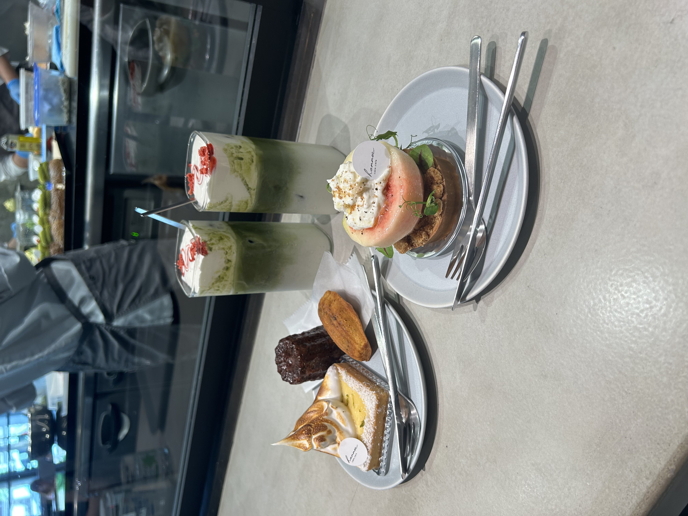

Hi! My name is Dai, and I am a Cognitive Science student at UCLA with interests in UX/UI design and human-centered product development.

I enjoy combining creativity with research to understand user needs and translate findings into thoughtful design solutions that brings both beauty and convenience to people's lives. Currently, I work as a Social Media & Design Specialist with UCLA Residential Life, where I create content and design materials that engage and inform on-campus residents.

Outside of academics and work, I enjoy art, traveling, and exploring new food spots.

*Kyoto, Japan*

*(っ˘ڡ˘ς)*

